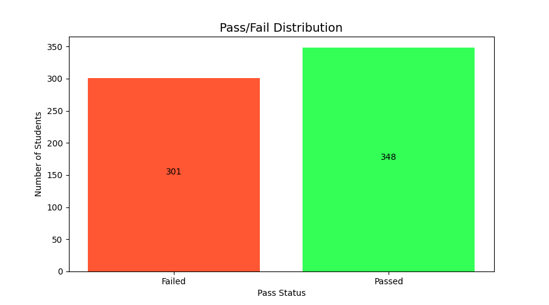
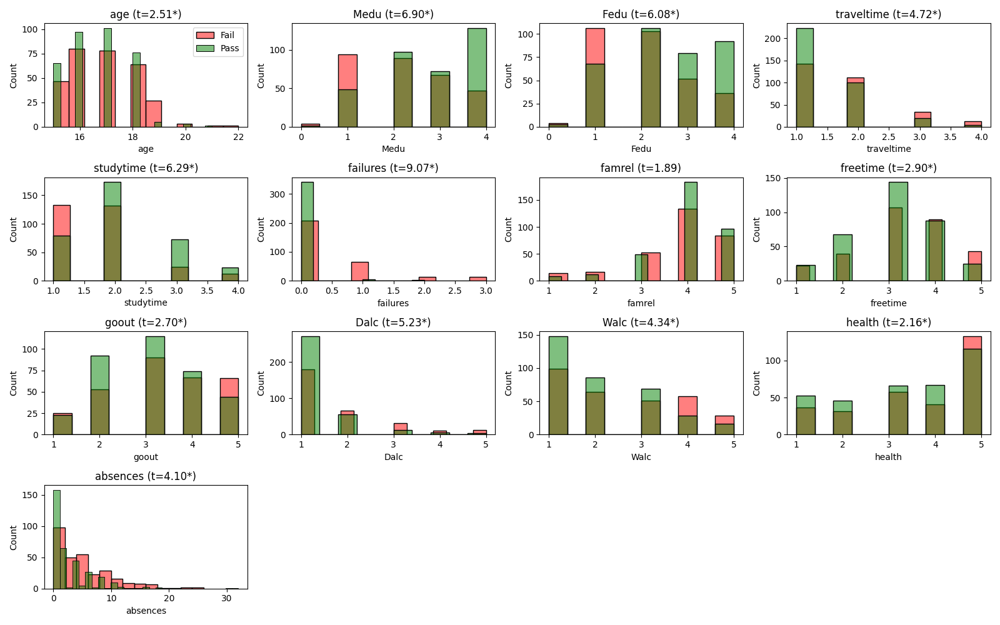

# **Student Performance Analysis and Prediction**  

## 📌 **Project Overview**  
This project analyses student performance using a dataset containing academic and socio-demographic attributes. The goal is to understand key factors influencing student success and build machine learning models to predict whether a student will pass or fail.  

By applying **statistical analysis, visualisation techniques, and machine learning models**, the project extracts insights and evaluates predictive performance.

---

## 📊 **Data Analysis and Feature Engineering**  
The dataset includes a variety of **numerical and categorical features**, such as **grades, parental education, study habits, and lifestyle factors**.  

### 🔹 **Feature Engineering Steps:**  
- **Handling missing values** and inconsistencies.  
- **Statistical analysis** of each feature:
  - **T-tests** for numerical features.
  - **Chi-square tests** for categorical features.  
- **Feature transformations**:
  - Creating a **Parental Education Score** (multiplication of maternal and paternal education levels).  
  - Constructing a **Study vs. Failure Ratio**.  
  - Averaging **weekday and weekend alcohol consumption**.  
- **One-hot encoding** categorical features for machine learning compatibility.  

> **Key Findings:**  
> - **Study time and parental education** were the strongest predictors.  
> - **Alcohol consumption** and **past failures** negatively correlated with success.  

---

## 📈 **Visualisations and Exploratory Analysis**  
A series of **data visualisations** were generated to explore patterns and relationships:  

### 🔸 **Pass/Fail Distribution**  
  

### 🔸 **Feature Impact Analysis**  
  

### 🔸 **Pass Rate by Categorical Variables**  
  

### 🔸 **Feature Importance from Random Forest**  
  

These visualisations provided a solid foundation for selecting features and refining the models.

---

## 🤖 **Machine Learning Models and Performance**  
Several **classification models** were trained and optimised using **GridSearchCV with cross-validation**:

| Model                | Accuracy | Precision | Recall | F1 Score | AUC  |
|----------------------|---------|----------|--------|----------|------|
| **Random Forest**    | **85%**  | **0.86** | 0.84   | **0.85** | 0.91 |
| **SVM**             | 81%      | 0.82     | 0.78   | 0.80     | 0.87 |
| **Logistic Regression** | 79%  | 0.80     | 0.76   | 0.78     | 0.85 |
| **KNN**             | 78%      | 0.79     | 0.74   | 0.76     | 0.83 |

> **Random Forest emerged as the best performer** with an accuracy of **85%** and the highest AUC score.

---

## 🔬 **Model Evaluation and Interpretation**  

### 🔹 **Confusion Matrices**  
Each model's **confusion matrix** was plotted to visualise classification errors.  

  
  

- **Random Forest** had the best balance of precision and recall.  
- **SVM and Logistic Regression** misclassified some failing students as passing.  

### 🔹 **ROC Curves and AUC Scores**  
  

The **Random Forest model** achieved the highest **AUC (0.91)**, showing the strongest ability to differentiate between passing and failing students.  

---

## 🏆 **Feature Importance Analysis**  
The **Random Forest feature rankings** highlight the most important predictors:

| Feature            | Importance |
|-------------------|------------|
| **Study Time**    | 🔥 High |
| **Failures**      | 🔥 High |
| **Parental Education** | 🔥 High |
| **Alcohol Consumption** | ❄️ Negative Impact |

These insights reinforce the importance of structured study habits and parental support in academic success.

---

## 🔑 **Key Findings and Insights**  
1️⃣ **Study time and parental education** are the strongest predictors of academic success.  
2️⃣ **Alcohol consumption and past failures** have a negative impact on student performance.  
3️⃣ **Random Forest outperforms all other models**, making it the best choice for predictive analysis.  
4️⃣ Some features (**school type, travel time**) had minimal impact and could be removed in future iterations.  

---

## 🔮 **Conclusion**  
This project successfully explored student performance data using **statistical analysis, machine learning, and data visualisation**.  

- **Random Forest** proved to be the most effective predictive model.  
- **Feature importance analysis** confirmed key academic and lifestyle factors affecting student outcomes.  
- The study provides insights that could help educators and policymakers improve student performance.  

---
